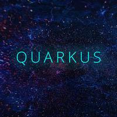

### Create project

In order to create your first project, it's easy enough to use mvn and use the Quarkus plugin.
```
mvn io.quarkus:quarkus-maven-plugin:0.13.1:create \
    -DprojectGroupId=your.group.id \
    -DprojectArtifactId=Your_artifact_id \
    -DclassName="package.and.class.name.of.your.first.Resource" \
    -Dpath="/your_endpoint"

```

### Run 

Once that you have your project created, you just need to run the compile and run command of mvn quarkus

```
./mvnw compile quarkus:dev`
```

Now you can reach the application container `indext.html` `http://localhost:8080/`

And if you want to reach your first endpoint created you can go to `http://localhost:8080/your_endpoint`


### CDI(Context and Dependency Injection)

In Quarkus the Dependency injection happens when we compile our project, that's the reason why it's so fast.
 That brings some limitations, like the use of Reflection in your application it's limited.
 You can read the way to inject dependencies in your project purely with annotations [here](https://quarkus.io/guides/cdi-reference.html)
 
### Program

Here I develop a simple Serverless where thanks to Quarkus and JAX-RS we make the transport(Request/Response) layer totally agnostic.
You can see the API resource of the application as entry point [here](src/main/java/com/politrons/quarkus/resource/PolitronsQuarkusResource.java)   